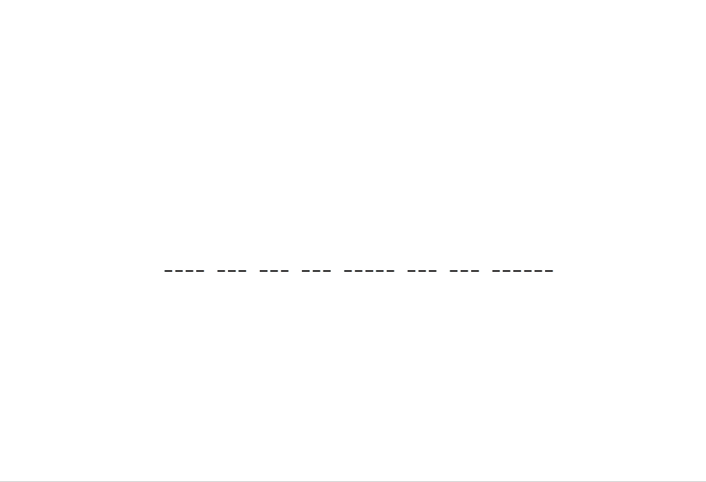

# jspsych-comprehension-question

This is a custom jsPsych plugin I wrote to create a new comprehension question format for my self-paced reading experiments.

The code is adapted from Shane Martin's [jspsych-survey-multi-choice](https://www.jspsych.org/plugins/jspsych-survey-multi-choice/) plugin.

## Parameters

- __prompt:__ The text displayed at the top of the screen during the trial
- __word:__ The word or words that appear between the two input fields
- __menu1:__ The response options for the first input field
- __menu2:__ The response options for the second input field
- __correct1:__ The correct answer for the first input field
- __correct2:__ The correct answer for the second input field
- __button_label:__ The label for the button to continue to the next trial